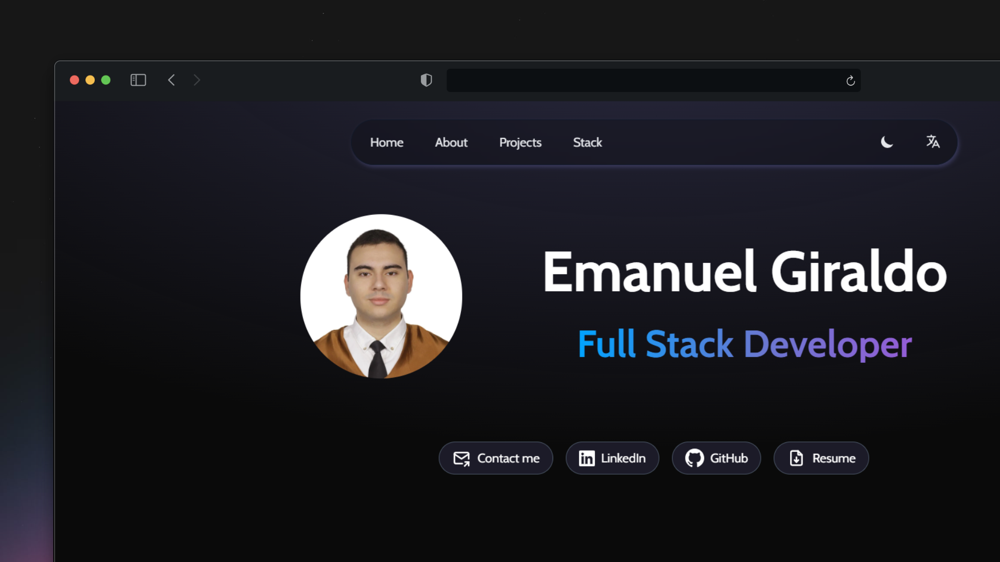
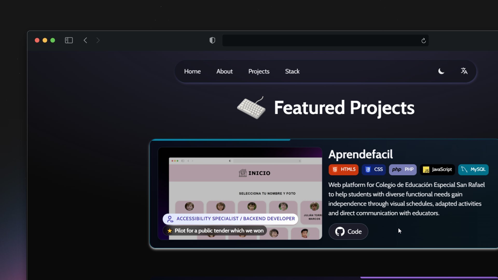
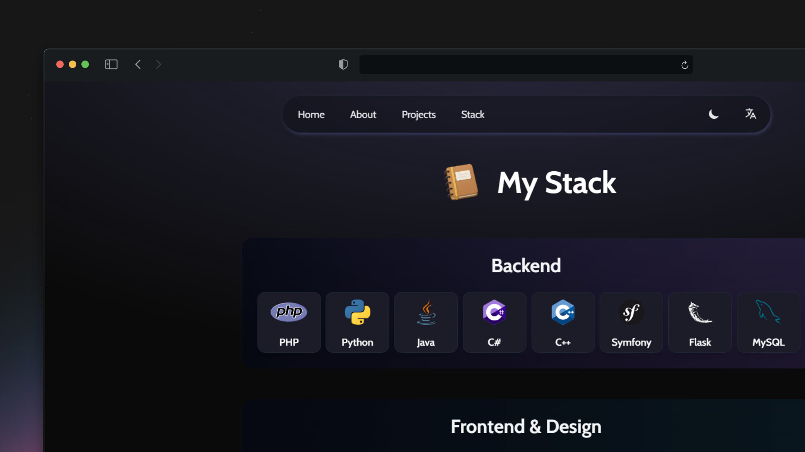

# Personal Portfolio

Portfolio para mostrar mi perfil, mis proyectos destacados y el stack tecnológico que manejo. Cuenta con modo claro/oscuro y traducción dinámica entre español e inglés.

📌 https://emanuelgh.dev

    

    
    
    
    
    
    

## 📄 Licencia

Este proyecto está bajo la [Licencia MIT](LICENSE). Siéntete libre de usarlo y modificarlo a tu gusto, así como también es bienvenida cualquier contribución. No se requiere atribución, pero se agradece enormemente.